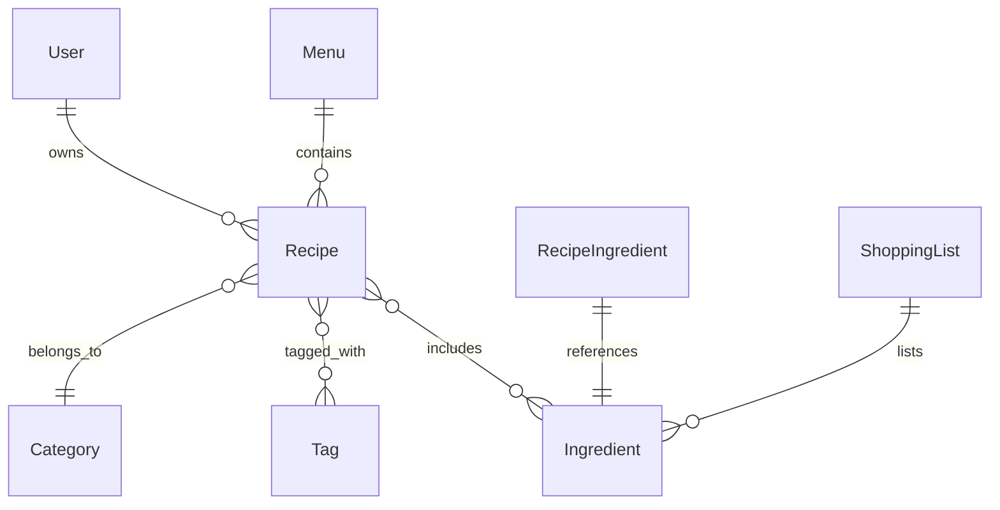

# Project Plan: Family Recipe Web Application

Below is a complete roadmap to transform your Google Doc of family recipes into a robust web app. It’s organized into phases, with technology choices, data models, APIs, front-end architecture, and deployment steps. You’ll also find alternative recommendations and “next-level” ideas you didn’t ask for but will likely appreciate.

---

## 1. Define Scope & MVP

1. **Core Features (MVP)**  
   - Import and display recipes  
   - Categorize and tag recipes  
   - Search and filter by title, ingredient, category, or tag  
   - Add/edit/delete recipes  

2. **Phase 2 Enhancements**  
   - Weekly menu planner  
   - Automated shopping list generation  
   - User authentication and family sharing  

3. **Long-Term Extensions**  
   - Recipe ratings/comments  
   - Version history and audit trail  
   - Mobile-friendly PWA with offline access  

---

## 2. Technology Stack

### Backend  
- Primary: ASP.NET Core (C#) Web API  
- ORM: Entity Framework Core  
- Database: PostgreSQL  
- Authentication: ASP.NET Identity + JWT or IdentityServer4  

### Frontend  
- Framework: React  
- Routing: React Router v6  
- State Management: Context API or Redux Toolkit  
- Styling: Tailwind CSS or Chakra UI  

### DevOps & Hosting  
- Containerization: Docker  
- CI/CD: GitHub Actions  
- Hosting Options:  
  - Azure App Service + Azure Database for PostgreSQL  
  - DigitalOcean App Platform + Managed Postgres  
  - AWS Elastic Beanstalk + RDS  

---

## 3. Data Model

**Entities & Key Fields**  
- **User**: Id, Name, Email, PasswordHash, Role  
- **Recipe**: Id, Title, Description (Markdown), Instructions (Markdown), PrepTime, CookTime, ServingSize, CreatedBy, CreatedAt  
- **Category**: Id, Name  
- **Tag**: Id, Name  
- **Ingredient**: Id, Name  
- **RecipeIngredient**: RecipeId, IngredientId, Quantity, Unit  
- **Menu**: Id, UserId, WeekStartDate  
- **MenuItem**: MenuId, RecipeId, DayOfWeek, MealType  
- **ShoppingList**: Id, MenuId, GeneratedAt  

---

## 4. API Design

### Authentication  
- POST `/api/auth/register`  
- POST `/api/auth/login` → returns JWT  

### Recipe Management  
- GET `/api/recipes` (with query params for search, filter, pagination)  
- POST `/api/recipes`  
- GET `/api/recipes/{id}`  
- PUT `/api/recipes/{id}`  
- DELETE `/api/recipes/{id}`  

### Categories & Tags  
- GET `/api/categories`, `/api/tags`  
- POST `/api/categories`, `/api/tags` (admin only)  

### Menu Planner & Shopping List  
- GET `/api/menus?week=YYYY-MM-DD`  
- POST `/api/menus`  
- PUT `/api/menus/{id}`  
- GET `/api/menus/{id}/shopping-list`  

---

## 5. Front-End Architecture

### Component Hierarchy  
- **App**  
  - **AuthProvider** (context)  
  - **Layout** (navbar, sidebar)  
    - **RecipeListPage**  
    - **RecipeDetailPage**  
    - **RecipeFormPage**  
    - **MenuPlannerPage**  
    - **ShoppingListPage**  

### State Patterns  
- Global: user session, theme, notifications  
- Local: form state, list filters  
- Sync with backend via a reusable `apiClient` (Axios + interceptors for JWT)  

### Search & Caching  
- Debounced search input  
- Use React Query or custom SWR for server-state caching  

---

## 6. Development Roadmap

1. **Setup & Authentication**  
   - Scaffold ASP.NET Core Web API  
   - Integrate EF Core & PostgreSQL  
   - Add Identity + JWT login/register  
   - Create GitHub repo & CI pipeline  

2. **Recipe CRUD**  
   - Design database migrations  
   - Build Recipe endpoints & DTOs  
   - Develop React pages for listing and editing  

3. **Categories, Tags, Ingredients**  
   - CRUD endpoints and UI components  
   - Multi-select tag picker  
   - Full-text search setup in Postgres  

4. **Menu Planner & Shopping List**  
   - Model menus and lists  
   - UI calendar grid for weekly menus  
   - Generate aggregated shopping list  

5. **Polish & Testing**  
   - Form validation (FluentValidation + React Hook Form)  
   - Unit tests (xUnit) and integration tests  
   - E2E tests with Playwright or Cypress  

6. **Deploy & Monitor**  
   - Dockerize backend and frontend  
   - Configure Azure/DigitalOcean services  
   - Add logging (Serilog) and basic metrics (Prometheus/ Grafana or Azure Monitor)  

---

## 7. Alternative Suggestions

- **Backend-as-a-Service**: Supabase (Postgres + Auth out of the box) plus Next.js API routes  
- **Full-Stack JS**: Next.js (React) + Prisma + PostgreSQL — faster prototyping, built-in routing, and API layer  
- **Headless CMS**: Strapi or Cockpit for recipe content management, then build a React front end  

---

## 8. Next-Level Ideas

- **Markdown Importer**: Write a small script to parse your Google Doc export (HTML or Markdown) into initial recipe records.  
- **Image Upload & Processing**: Integrate Cloudinary or Azure Blob Storage for family photos of dishes.  
- **Nutrition Analysis**: Hook into a nutrition-data API to compute calories per recipe.  
- **Mobile PWA**: Leverage service workers for offline recipe access in the kitchen.  
- **Audit Trail**: Keep a history of recipe edits so you can see Grandma’s original measurements.  

---

With this blueprint, you can tackle the project in modular stages, benchmark progress, and ensure a resilient, family-friendly platform. Let’s start by defining your database schema and spinning up the ASP.NET Core starter project—what would you like to dig into first?